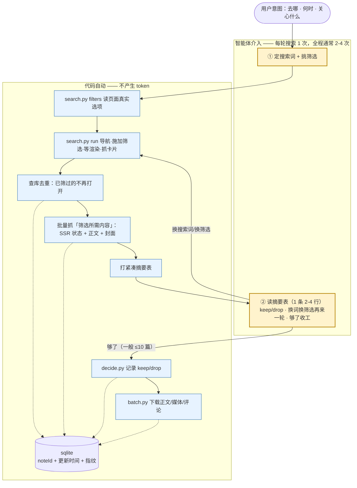

# 小红书笔记调研与下载

一件事：**按意图搜 → 看一张摘要表筛出清单 → 下载清单里的笔记**。

## 依赖

- `chrome-agent` 命令必须可用（CLI + daemon + 已加载扩展 + 一个已登录小红书的标签页）。
  本站不 import 它的代码，只调它的 CLI 与 `--json` 输出。
- 脚本用绝对路径运行，不依赖当前工作目录：

```bash
SITE="$HOME/.claude/skills/xhs-downloader"   # 源码仓库里换成 .../travel_agent/skills/xhs-downloader
chrome-agent tabs list --json                # 挑一个已登录小红书的标签页，记下 tab-id
chrome-agent tabs activate <tab-id> --json   # 采评论必须在前台
```

## 按需加载

| 需要什么 | 读哪份 |
|---|---|
| 一步步跑完一次（第一次照做） | [references/flow.md](references/flow.md) |
| 报错、行为反常、搜不到结果 | [references/pitfalls.md](references/pitfalls.md) |
| 改脚本、改选择器、改产出结构 | [references/files.md](references/files.md) |
| 定搜索词与筛选、筛选没生效 | [references/filters.md](references/filters.md) |
| 判断哪几篇值得下载 | [references/selection.md](references/selection.md) |

## 两阶段

**一轮搜索 = 一次介入。** 脚本干机械活（导航、等渲染、点筛选、抓状态、落正文与封面、去重），
你只做两件机器做不了的事：把意图翻成搜索词与筛选，和对候选做 keep/drop 的相关性判断。

```bash
# ① 看页面真实有哪些筛选选项（不写死词表）
python "$SITE/scripts/search.py" filters --tab-id <tab>

# ② 一轮搜索：施加筛选 → 等渲染 → 抓候选 → 批量初筛 → 打一张摘要表
python "$SITE/scripts/search.py" run --tab-id <tab> \
  --keywords "川西秋色;稻城亚丁 秋" --filters "排序依据=最新;半年内" \
  --limit 20 --screen-limit 20 --excerpt 150          # 打印 run id

# ③ 记判断（只写库，不抓页面；一次可记多条）
python "$SITE/scripts/decide.py" keep --run-id 7 --note-id <id>,<id> --reason "有时间表和机位"
python "$SITE/scripts/decide.py" drop --run-id 7 --note-id <id> --reason "只有风景照"
python "$SITE/scripts/decide.py" show --run-id 7                        # 紧凑清单

# ④ 阶段二：下载被标成 keep 的笔记
python "$SITE/scripts/batch.py" --tab-id <tab> --run-id 7 \
  --part body,media,comments --dedup skip --interval 15
```

数据默认落在 `~/Documents/travel_agent`（`--data-root` 或 `$XHS_DATA_ROOT` 可指定）：
库 `<root>/xhs.db`，笔记 `<root>/notes/<noteId>/`（`note.json` / `comments.json` / `downloads.json` / `images/`）。



## 硬性不变量

1. **详情链接原样用**：href 里的 `xsec_token` 是访问上下文，禁止从笔记 ID 拼接、缩短或删除；
   落盘 URL 里的 token 会过期，过期后按 `keywords` 回搜索页重新发现。
2. **一个参数，分号分隔**：`--keywords "a;b"`、`--filters "排序依据=最新;半年内"`，
   **不重复传同一个 flag**。关键词可能含逗号，所以分隔符是 `;`。
3. **筛选只能点控件**：URL 上拼 `sort=`/`noteType=` 一律无效（实测，见 `references/filters.md`）；
   点完必须验证页面把该项标成生效项，没生效就中止——否则会拿回一批没筛过的结果。
4. **读评论必须前台标签页**（`tabs activate`），后台标签页会被降频，滚到底也不加载。
5. **下载成功 = `state=complete` 且 `filename` 非空**，发现 URL 不等于下载完成。
6. **全文落盘、只回摘要**：正文全文只写 `note.json`，永不打到 stdout；摘要表的 `--excerpt`
   是 token 成本的主要旋钮。
7. **够了就停**：信息已足以判断时不得继续抓笔记；一轮摘要表够用就不要再开一轮。
8. **每个 part 自取快照**，可单独反复跑；同一访问内手工连跑多个 part 时 `comments` 必须最后
   （滚动会把轮播挤出快照窗口）。`ref` 只属于当次快照，不许跨快照复用。
